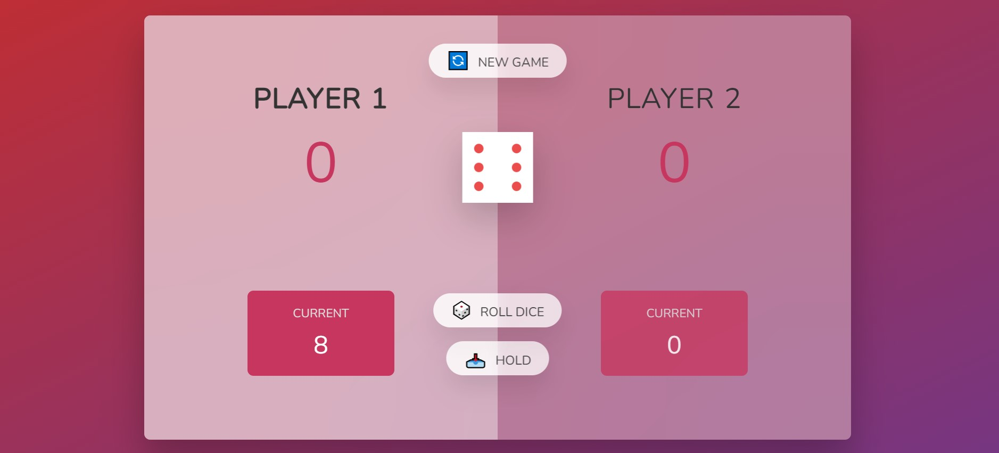

# 🐷 Pig Dice Game([play now](https://yuvrajrawat14.github.io/PigGame/))

Welcome to the **Pig Dice Game**, a simple and fun two-player dice game built using HTML, CSS, and JavaScript. Challenge your friends and see who can reach the target score first without losing their points!

## 📸 Screenshots

Gameplay: Here's a quick snapshot of how the game looks in action!

## 🎮 How to Play

1. **Roll the Dice**: Each player takes turns rolling a single dice as many times as they want during their turn.
2. **Accumulate Points**: Every time you roll, your points for that round add up.
3. **Beware of 1**: If you roll a `1`, your current round score resets to zero, and it's your opponent's turn.
4. **Hold Your Points**: Choose to hold and save your round points to your total score. The first player to reach **100 points** wins the game!

Can you take risks or play it safe? 🏆

## ✨ Features

- **Two-Player Mode**: Play against a friend or family member in this turn-based game.
- **Easy to Use**: Simple controls make it easy for anyone to pick up and play.

## 🛠️ Technologies Used

- **HTML5**: The basic structure of the game.
- **CSS3**: Styling and layout.
- **JavaScript**: Game logic for rolling dice, calculating scores, and switching turns.
